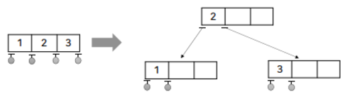

# 2-3-4 Tree
하나의 노드가 4개의 자식까지 가질 수 있는 트리이다.

2-3-4 트리도 **이진 탐색 트리를 기반**으로 만들어진다.  
ALV보다 균형 트리를 간단하게 만들 수 있다는 장점이 있다.

## 2-3-4 트리의 연산
1. 삽입   

    i. 삽입해야할 단말 노드에 데이터가 1, 2개일 때   

    그냥 삽입

    ii. 삽입해야할 단말 노드에 데이터가 3개일 때

    데이터 삽입 전 미리 **middle 값을 부모노드**로 올리고 **left, right 노드를 자식 노드로 분리**한다.

    이 후 자리에 맞춰 데이터 삽입

    

2. 삭제
    업데이트 예정