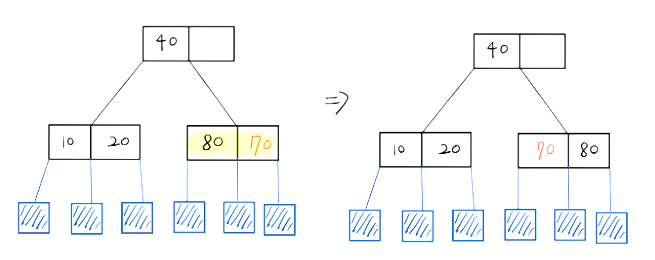
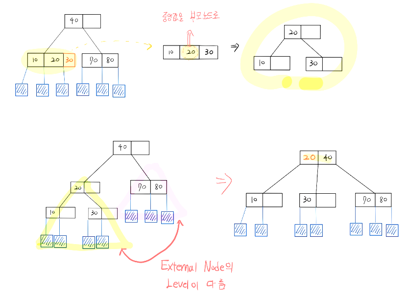

# 2-3 Tree
2-3 Tree는 **차수가 2 아님 3인** 트리이다.

2-3 트리도 **이진 탐색 트리를 기반**으로 만들어진다.  
ALV보다 균형 트리를 간단하게 만들 수 있다는 장점이 있다.

## 2-3 트리의 연산
1. **삽입**  

    i. 노드의 데이터가 1개일 때   

    노드에 값을 넣는다.

    

    ii.**노드에 더 이상 데이터가 삽입이 되지 않을 때** (노드 안의 데이터 개수가 2개)
    
    **middle 값을 부모노드**로 올리고 **left와 right의 값을 자식 노드로 분리**한다.

     

2. **삭제**   
    업데이트 예정

### 2-3-4 트리와의 차이점
데이터 삽입 시 분할을 **데이터를 넣은 후 분할**한다.