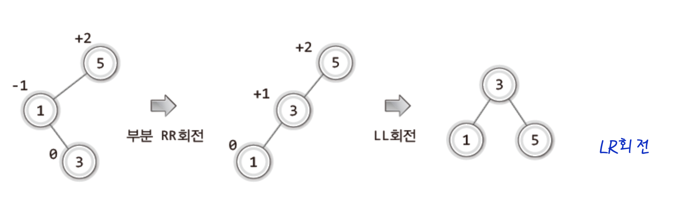

# AVL Tree
각 노드에서 왼쪽 서브 트리의 높이와 오른 쪽 서브 트리의 높이 차이가 1 이하인 이진 탐색트리를 말한다. 

AVL트리 **이진 탐색 트리를 기반**으로 만들어진다.   
AVL트리는 트리가 **비균형 상태**로 되면 **스스로 노드들을 재배치**하여 균형 상태로 만든다.

**Balance factor**   
균형인수는 **( 왼쪽 서브 트리의 높이 ) - ( 오른쪽 서브 트리의 높이 )** 로 정의 된다.

모든 균형인수가 **± 1 이하**이면 AVL 트리이다.

### 사용 이유
균형을 이룬 이진 탐색 트리는 기존의 이진 탐색 트리보다 **탐색이 훨씬 빨라지기 때문**이다.

## 균형 유지 알고리즘
1. **LL**

    
2. **RR**

    
3. **LR**

    
4. **RL**

    