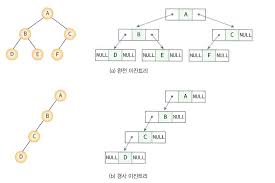
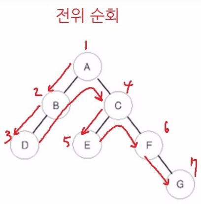
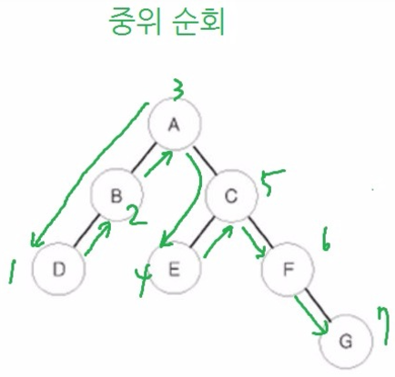
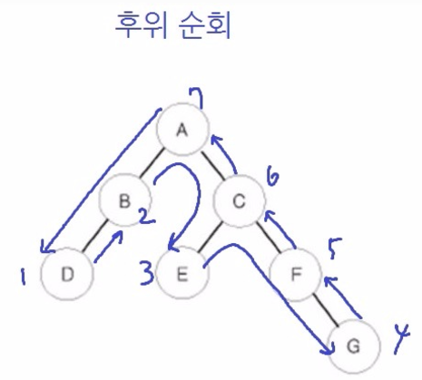
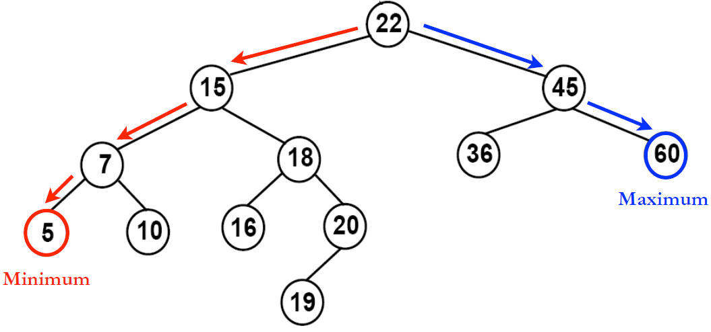
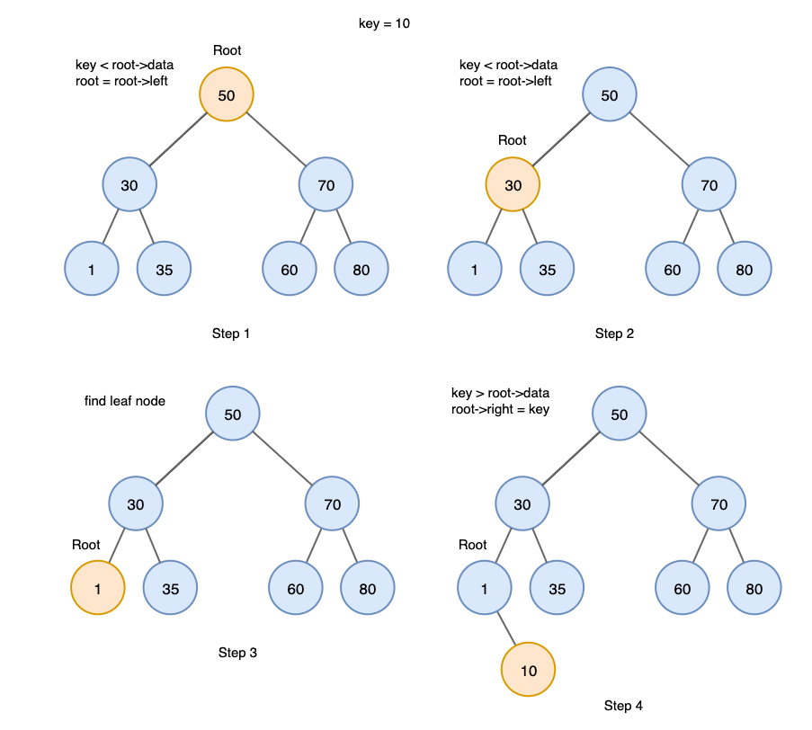
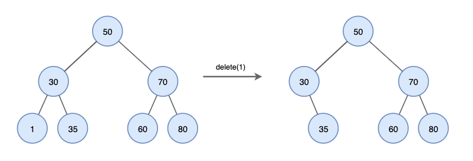

# 이진 트리
### 이진 트리의 종류

### 이진 트리의 표현
1. 이진 트리의 배열 표현법
    
       

    노드 i의 **부모** 노드 인덱스 = **i // 2**   
    노드 i의 **왼쪽** 자식 인덱스 = **i * 2**   
    노드 i의 **오른쪽** 자식 인덱스 = **i * 2 + 1** 

2. 이진 트리의 링크(노드 연결) 표현법
    >구조체와 포인터 개념을 이용

    

## 이진 트리의 순회
1. 전위 순회 (VLR)

    

2. 중위 순회 (LVR)

    

3. 후위 순회 (LRV)

    

# 이진 탐색 트리(Binary search tree)
이진 탐색 트리는 루트에 저장된 값보다 **작은 값**들로만 구성된 이진 탐색 트리를 **왼쪽 서브 트리**로 가지고 있고,   
루트에 저장된 값보다 **큰 값**들만으로 구성된 이진 탐색 트리를 **오른쪽 서브 트리**로 가지고 있는 이진 트리이다.

### 이진 탐색 트리 정의
1. 모든 노드는 서로 다른 **유일한 값**을 갖는다. (같은 값 삽입 불가)

2. **왼쪽 서브 트리**에 있는 노드들의 값은 그 **루트의 값보다 작다**.

3. **오른쪽 서브 트리**에 있는 노드들의 값은 그 **루트의 값보다 크다**.

4. 왼쪽 서브 트리와 오른쪽 서브 트리도 **이진 탐색 트리**이다.

### 이진 탐색 트리의 탐색
- "왼쪽 서브 트리 값 < 루트 값 < 오른쪽 서브 트리 값" **중위 순회**를 하게 되면 오름차순으로 정렬됨

### 이진 탐색 트리 탐색 알고리즘

1. **X == 루트 노드 값**: 노드를 찾았으므로 **탐색 종료**

2. **X < 루트 노드 값** : 루트 노드의 **왼쪽 서브 트리**에 대하여 값 X가 저장된 노드 탐색

3. **X > 루트 노드 값** : 루트 노드의 **오른쪽 서브 트리**에 대하여 값 X가 저장된 노드 탐색

### 이진 탐색 트리에서의 삽입
이진 탐색트리에서 새로운 원소를 삽입하기 위해서는 먼저 **동일한 원소가 트리 내에 있는 지 확인**하는 **탐색이 필요**하다.    
만약 동일한 원소가 없다면 **탐색이 실패하여 종료된 그 지점에 새로운 노드를 삽입**한다.

### 이진 탐색 트리에서의 삭제
1. 삭제하려는 노드가 단말 노드일 때
    >그냥 삭제

    
2. 삭제하려는 노드가 하나의 서브 트리를 가지고 있을 경우
    > 노드를 삭제하고 삭제된 노드의 부모에 연결한다.

    
3. 삭제하려는 노드가 두 개의 서브 트리를 가지고 있을 경우 
    > 삭제할 노드와 가장 비슷한 값을 가진 노드를 삭제 노드 위치로 가져온다.

    