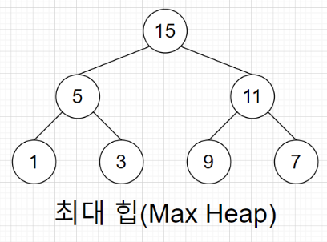
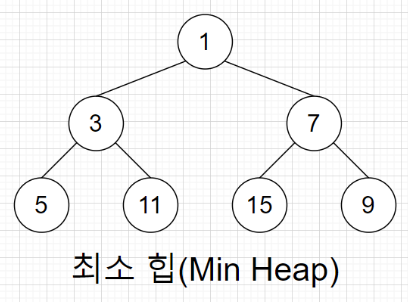
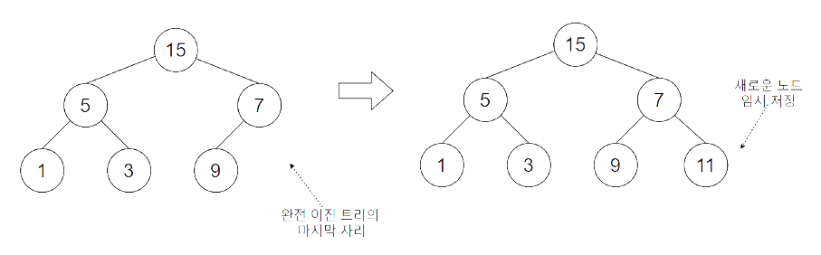
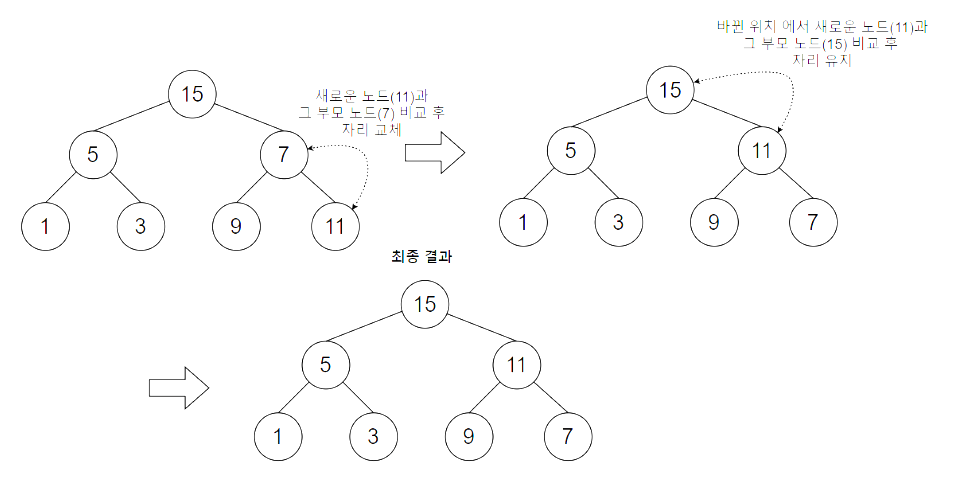
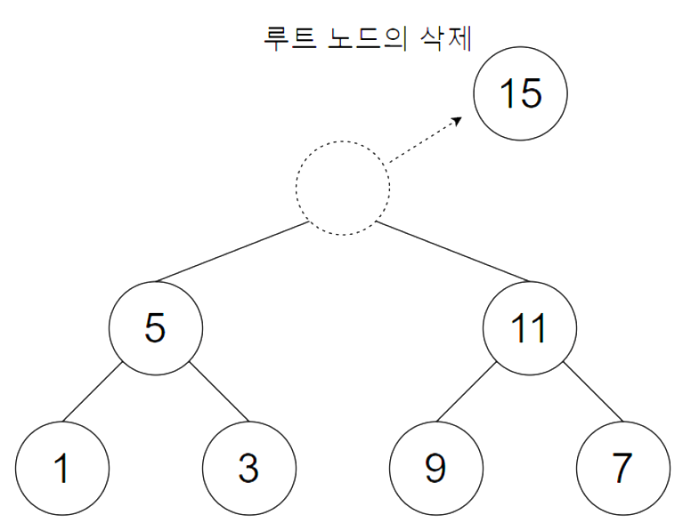
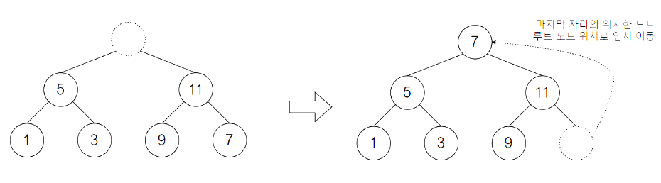
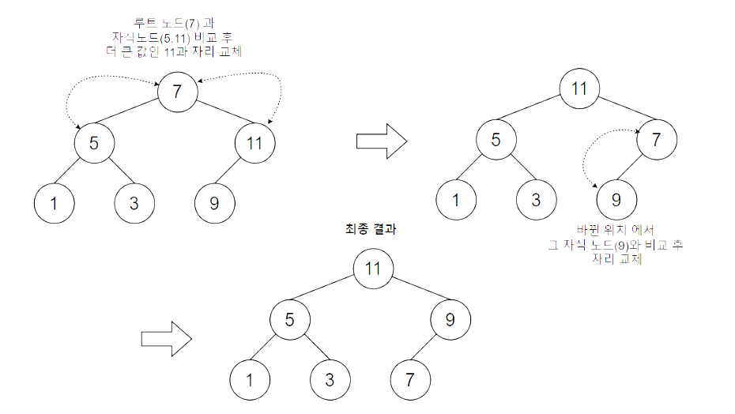

# Heap Tree
힙 트리는 **"무엇인가를 차곡차곡 쌓아올린 더미"** 라는 뜻을 가지고 있다.

항상 **완전 이진 트리**의 형태를 띠어야한다.    
따라서 배열로 구현이 쉽다.

힙 트리는 이진 탐색 트리보다 느슨한 규칙을 가지고 있다.   

힙의 규칙은 최대 힙(Max heap)이냐와 최소 힙(Min heap)에 따라 달라진다.

### Max heap
최대 힙은 **루트 노드가 가장 큰 값**이 되도록 형성 되어있는 heap이다.

### Min heap
최소 힙은 **루트 노드가 가장 작은 값**이 되도록 형성 되어있는 heap이다

## 최대 힙에서의 삽입 연산
1. 트리의 마지막 자리에 임시 저장

    

2. 부모 노드와 키 값 비교 및 이동

    

## 최대 힙에서의 삭제 연산
1. 루트 노드의 삭제

    

2. 트리 마지막 자리 노드의 임시 이동

    

3. 자식 노드와 키 값 비교 및 이동

    

최소 힙의 연산은 최대힙의 연산에서 키 값 비교만 최소 힙으로 바꿔주면 된다.