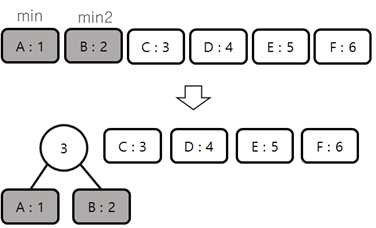
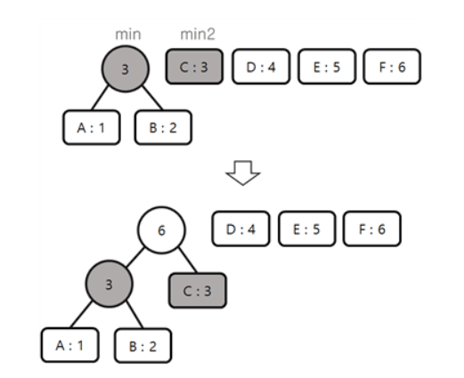
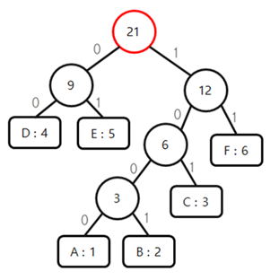

# Huffman code
허프만 코드는 데이터를 효율적으로 압축하는데 사용하는 방법으로 탐욕 알고리즘 중 하나이다.

**자주 나오는 문자**는 **짧은 비트**로 나타내고 **자주 나오지 않는 문자**는 **긴 비트**로 나타내는 방법이다.

예시)
압축하고자 하는 문자열 : ABBCCCDDDDEEEEEFFFFFF

고정 길이 코드 : A ~F. 6개의 문자를 구분하기 위해 3bit 필요. (2^2(4) < 6 < 2^3(8) 이므로 3bit가 필요하다.)

가변 길이 코드 : 허프만 코드를 이용해서 나온 값.

고정 길이 코드 : A = 000 , B = 001 , C = 010 , D = 011 , E = 100 , F = 101

가변 길이 코드 : A = 1000 , B = 1001 , C = 101 , D = 00 , E = 01 , F = 11

### 압축 결과
고정 길이 코드 : 000001001010010010011011011011100100100100100101101101101101101

가변 길이 코드 : 100010011001101101101000000000101010101111111111111

## 예시 허프만 코드 구현
1. 빈도수 계산   
    | A : 1 | B : 2 | C : 3 | D : 4 | E : 5 | F : 6 |

2. 빈도수가 가장 작은 2개의 노드들을 합쳐 트리를 구성한다. (더 작은 노드가 왼쪽)

    
3. 2번 반복

    
4. 결과

    

[출처](https://withhamit.tistory.com/12)