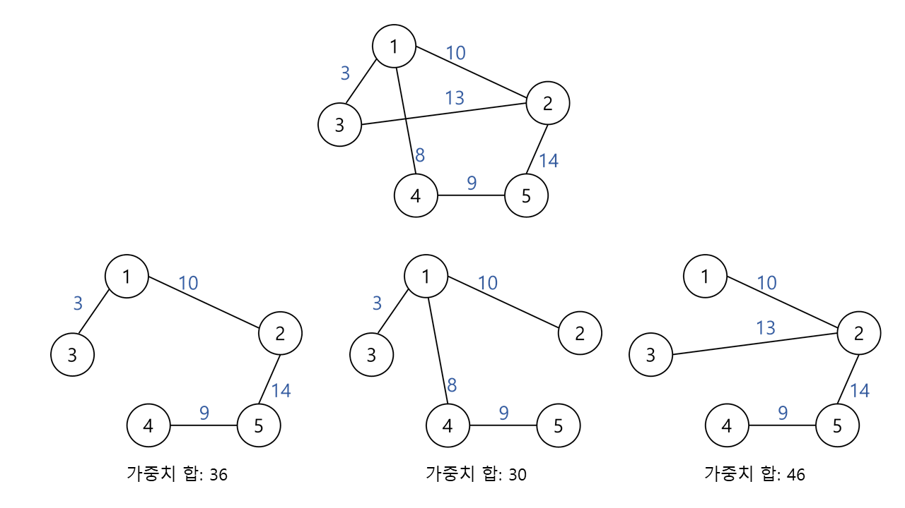
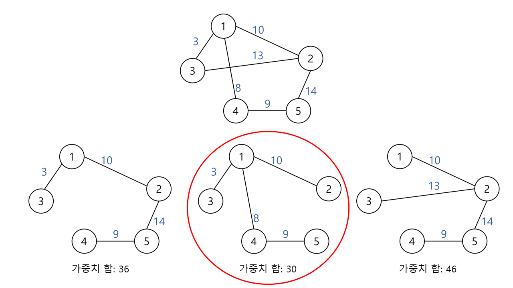

# 신장 트리 (Spanning Tree)
신장 트리는 하나의 그래프 내의 **모든 정점을 포함**하는 트리이다.   

**모든 정점들이 연결**되어 있어야 하고 **사이클을 포함해서는 안됨**

n개의 정점을 가지는 그래프의 신장트리는 n-1개의 간선을 가짐

최소의 링크를 사용하는 네트워크 구축 시 사용

# 최소 비용 신장 트리 (MST)
모든 정점들을 가장 적은 수의 간선과 비용으로 연결된 트리

최소 비용 신장트리를 구하는 방법으로는 Kruskal, Prim 알고리즘이 사용됨

